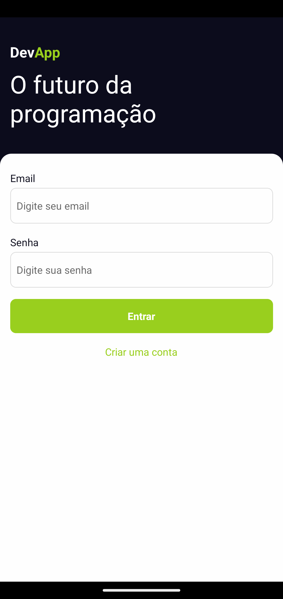
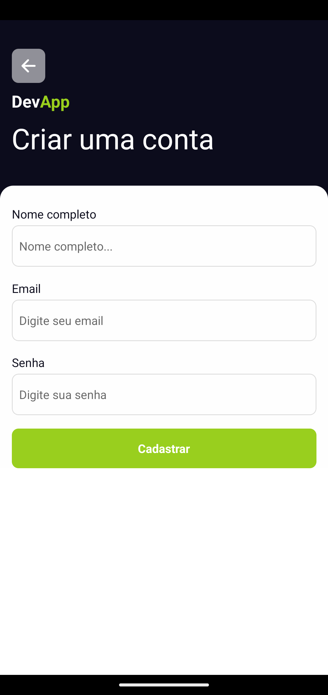
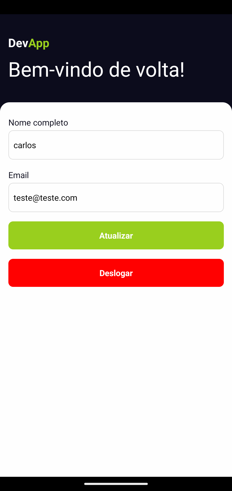

# APP-MOBILE-WALLET-SUPABASE
App mobile react native com a funcionalidade de login e cadastro de usuário conectado com banco de dados supabase.

### ⚙️ Pré-requisitos

1. Instalar Node.JS - https://nodejs.org/pt

2. Instalar Android Studio - https://developer.android.com/studio?hl=pt-br
    - More Actions > SDK Manager > SKD Tools - Instalar 'Google Play services'.
    - Adicionar varíavel de ambiente para user e sistema, nome: "ANDROID_HOME" e valor: (Android SDK Location).
    - More Actions > Virtual Devices Manager - Pixel 4.

### 🔨 Guia de instalação

1. Crie um arquivo chamado `.env.local` na raiz do projeto e defina as variáveis `EXPO_PUBLIC_SUPABASE_URL` e `EXPO_PUBLIC_SUPABASE_ANON_KEY` do supabase.

2. Na pasta do projeto execute o comando `npx expo start` e aperte a tecla `a` para iniciar com android.

## 📦 Tecnologias usadas:

Coloque aqui as ferramentas que você usou para criar seu projeto, exemplo:

* 
* 
* 

## ✨ Funcionalidades

* Login com email e senha
* Cadastro de usuário
* Atualização do nome do usuário
* Deslogar da conta no aplicativo

### Screenshots

